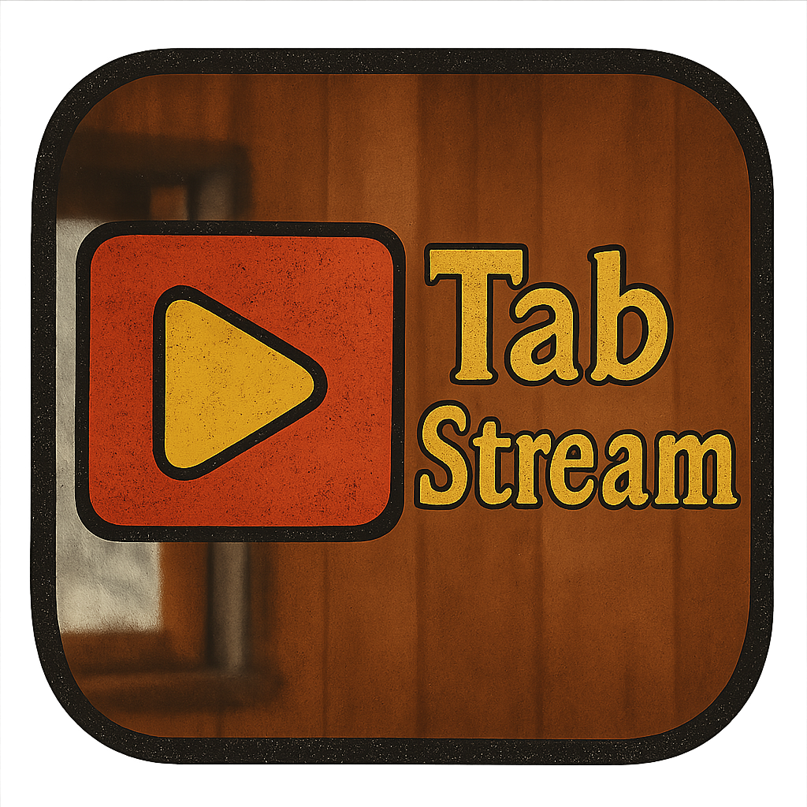

# Tab Stream

<p align="center">
  
</p>

A Chrome extension that helps guitarists find tabs and chord charts while watching YouTube videos. It uses Google Gemini AI to clean up video titles and extract artist/song information, plus provides an AI chat assistant to answer questions about guitar tabs, chords, and music theory.

I built this to help me learn guitar in the future - I got tired of manually searching for tabs every time I found a song I wanted to learn on YouTube. So I made this extension to do the work for me when I start learning!

## What it does

- **Pulls song info** from YouTube video titles using AI
- **Quick tab search** - one click to Ultimate Guitar, Songsterr, or Google
- **Ask the AI** about chords, difficulty, strumming patterns, etc.
- **Floats on YouTube** - doesn't get in the way of the video player
- **Works as you browse** - updates when you switch between videos

## Setup

### Get your API key

1. Head to [Google AI Studio](https://makersuite.google.com/app/apikey)
2. Create a new API key (it's free)
3. Copy the key

### Install the extension

1. Open `gemini.js` in the extension folder
2. Replace the placeholder with your API key:

```javascript
const GEMINI_API_KEY = 'your-actual-api-key-here';
```

3. Open Chrome → `chrome://extensions/`
4. Turn on "Developer mode" (top right)
5. Click "Load unpacked" and select the `tab-stream-extension` folder

### Test it out

1. Go to any YouTube music video
2. Look for the sidebar in the top-right corner
3. It should show the artist and song title

## How to use

### Song detection
The extension automatically:
- Grabs the video title from YouTube
- Uses AI to clean it up and extract artist/song info
- Shows the results in the sidebar

### Finding tabs
Click any of the tab buttons:
- **Ultimate Guitar** - huge database of tabs
- **Songsterr** - interactive tabs with playback
- **Google Search** - broad search for guitar resources

### Chat with AI
Ask questions like:
- "What are the main chords?"
- "Find fingerstyle tab"
- "Is this beginner-friendly?"
- "Show me the strumming pattern"

## Files

```
tab-stream-extension/
├── manifest.json          # Extension config
├── content.js            # Main logic
├── sidebar.css           # Styling
├── sidebar.html          # HTML template
├── sidebar.js            # Sidebar functions
├── gemini.js             # AI integration
└── README.md            # This file
```

## Customization

Want to change things up?

- **Move the sidebar**: Edit `sidebar.css` to change position
- **Add more tab sites**: Modify the URLs in `content.js`
- **Change the look**: Update colors and fonts in `sidebar.css`

## Troubleshooting

### Extension won't load
1. Check your API key in `gemini.js`
2. Make sure you're on a YouTube video page
3. Reload the extension in `chrome://extensions/`
4. Check the browser console (F12) for errors

### Sidebar missing
1. Verify you're on a video page (`youtube.com/watch?v=...`)
2. Refresh the page
3. Look for errors in the console

### API issues
1. Double-check your API key
2. Check your Google AI Studio quota
3. Make sure you have internet

## Development

### Making changes
1. Edit the files
2. Reload the extension in `chrome://extensions/`
3. Refresh YouTube to test

### Debugging
1. Open DevTools (F12)
2. Check the Console tab for errors
3. Look at the Network tab for failed API calls

## Privacy

- Only sends video titles to Google's AI
- No personal data collected
- Everything happens in your browser
- Direct connection to Google's servers

## Support

Having trouble?

1. Check the troubleshooting section above
2. Verify your API key
3. Make sure you're on a supported YouTube page
4. Check the browser console for errors

## License

MIT License - feel free to use and modify!

## Contact

**Brian Maine**  
bmmaina@bu.edu

---

